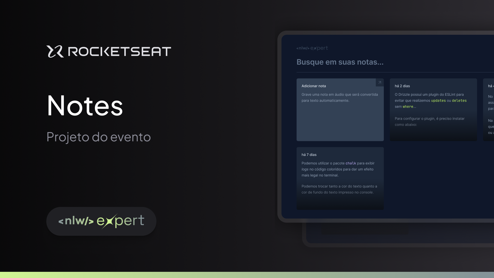

  

## Notes website to save important thinks

---

## 🎥 Preview

### Add a new note by text ✏️

 

### Add a new note by audio 🎤

 

### Filter notes 🔎

 

### Responsive 📱

 

---

## 📚 Learning

All the things that I learned and practiced with this project

- I learned about `the speech recognition API` to record audio and transcript it
- I learned more about `how create responsive application with tailwindCSS`

 

---

## 🧪 Technologies

This project was developed using de following technologies:

- [React](https://react.dev/)
- [Typescript](https://www.typescriptlang.org/)
- [Radix](https://www.radix-ui.com/)
- [Date fns](https://date-fns.org/)
- [Lucide Icons](https://lucide.dev/)
- [Sonner](https://sonner.emilkowal.ski/)
- [TailwindCSS](https://tailwindcss.com/)

 

---

## 🔖 Layout

You can view the project layout through the links below:

- [Layout](https://www.figma.com/community/file/1336456128647909148/nlw-expert-notes)

Remembering that you need to have a [Figma](http://figma.com/) account to access it.

 

---

Developed by [ricardorhv](https://github.com/ricardorhv) 🖤
